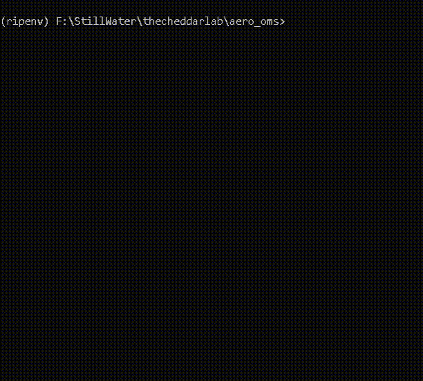

# Regional & National Air Traffic Control Simulator

  

A lightweight, modular air traffic simulation suite for prototyping, education, and research. Simulates flights between U.S. airports, with regional (PNW) and full national airspace options, runway queueing, controller AI, and live data dashboards.

## Features
- Simulates thousands to tens of thousands of flights between real U.S. airports
- FAA region-based and national-scale simulation
- Runway slotting and takeoff queue logic (regional)
- Simple controller AI for sequencing and spacing (regional)
- Tracks delays, runway utilization, and go-arounds (regional)
- Tracks flight types (🛫 Commercial, 🛩️ General Aviation, 🚕 Air Taxi, 🪖 Military, 📦 Cargo) (national)
- Logs simulation data to CSV for analysis (regional)
- Rich CLI visualization with color-coded flight phases and live updating tables
- Live dashboard for national simulation, updating minute-by-minute

## Usage

### Requirements
- Python 3.7+
- `rich` library (`pip install rich`)
- For geodesy (v3): `geopy` (`pip install geopy`)

### Running the Simulators

#### Regional (PNW) Simulators
- **Basic:**
  ```bash
  python aero_oms.py --ticks 30 --flights 15 --realtime 0.8
  ```
- **With Runway Queue, AI, Logging:**
  ```bash
  python aero_oms_v2.py --ticks 30 --flights 15 --realtime 0.8
  ```
- **With Geodesy (realistic positions):**
  ```bash
  python aero_oms_v3.py --ticks 10000 --flights 30 --realtime 0.05 --tick_minutes 1
  ```

#### National Airspace Simulator (Live Dashboard)
- **Nationwide, FAA region-based, live dashboard:**
  ```bash
  python nation_oms.py
  ```
  - Simulates ~87,000 flights across all FAA regions and types
  - Live dashboard updates every simulated minute (default: 1 second per tick)
  - Two tables: (1) summary by region/type/status, (2) sample of active flights with progress
  - Can be left running in the background for hours

### Output
- **Regional:** CLI table showing all flights, their phases, altitudes, and delays; runway utilization per airport; `sim_log.csv` for detailed logs
- **National:** Live dashboard with two tables, tracking all flights by region and type, with emoji-coded columns and real-time progress

## File Descriptions
- `aero_oms.py`: Original regional simulator. Simulates basic flight phases with CLI visualization.
- `aero_oms_v2.py`: Enhanced regional simulator with runway queue, controller AI, delay tracking, and CSV logging.
- `aero_oms_v3.py`: Regional simulator with geodesy (realistic positions and distances).
- `nation_oms.py`: National airspace simulator. Simulates all FAA regions and flight types, with a live updating dashboard.
- `development/feedback.log`: AI and user feedback, feature ideas, and roadmap notes.
- `development/progress.log`: Milestone and progress tracking (see for latest changes).
- `development/progresstemplate.md`: Template for progress logs.
- `development/airtraffic.md`: FAA region and flight type data source.

## Next Steps / Roadmap
- Add airport and position data to national simulation
- Simulate inter-region flights and more detailed flight progress
- Add weather, delays, and emergencies
- Visualize airspace and traffic density with Plotly or Dash
- Add interactive ATC trainer mode or human-in-the-loop CLI prompts

## License
MIT (or specify your own) 
